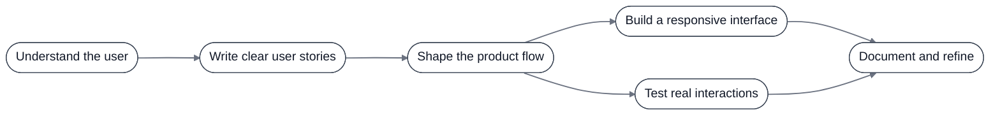

<h1 align="center">Malik Abuallatta</h1>

<strong>Full-stack developer</strong>

<table align="center">
  <tr>
    <td align="center"><a href="https://malikahed.github.io/portfolio/"> <strong>Portfolio</strong></a></td>
    <td align="center"><a href="https://www.linkedin.com/in/malik-abuallatta-a6849a37b/"> <strong>LinkedIn</strong></a></td>
    <td align="center"><a href="mailto:malikabuallatta@gmail.com"> <strong>Email</strong></a></td>
    <td align="center"><a href="https://api.whatsapp.com/send?text=Hi%20Malik"> <strong>WhatsApp</strong></a></td>
  </tr>
</table>

<table>
  <tr>
    <td width="50%" valign="top">
      <h3>What I build</h3>
      
I turn complex workflows into calm, useful browser products that help people learn, decide, and get things done.

      
My work spans learning platforms, offline-first PWAs, developer tools, and interactive WebGL experiences, with a focus on clear flows and thoughtful details.

      
<strong>Khotwa</strong> is my education startup: a structured learning workspace that connects trusted source material, practice, worked solutions, review cards, and measurable progress.

    </td>
    <td width="50%" valign="top">
      <h3>Currently focused on</h3>
      <ul>
        <li>Turning real user stories into focused product experiences</li>
        <li>Designing accessible interfaces with clear information architecture</li>
        <li>Keeping systems small, inspectable, and easy to reproduce</li>
        <li>Using motion and interaction to communicate state and purpose</li>
        <li>Testing the details that make a product feel dependable</li>
      </ul>
    </td>
  </tr>
</table>

## What I work with

  
  
  
  
  
  
  
  
  
  
  
  
  
  
  
  
  
  
  
  
  

## Selected work

| Project | What it does | Demo | Repo |
| --- | --- | --- | --- |
| Khotwa · Tawjihi Learning App | Structured learning workspace with lessons, practice flows, worked solutions, and progress tracking. |  |  |
| StockThink | Private, zero-server chess analysis powered by Stockfish WebAssembly and explainable move commentary. |  |  |
| Murajaa | Offline-first flashcards with spaced repetition, progress tracking, and JSON import/export. |  |  |
| Portfolio World | Interactive Three.js/WebGL portfolio focused on composition, interaction, and performance. |  |  |
| Rocket Arena Web | Playable browser game with AI opponents and a complete web build. |  |  |

## How I work

<strong>Open to full-stack, frontend, developer-tool, and educational technology opportunities.</strong>

