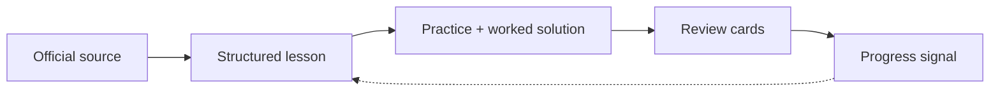

  

  

  
  
  

<strong>Full-stack developer and product builder from Palestine.</strong> I turn complex workflows into clear, fast, accessible browser products.

<table>
  <tr>
    <td width="50%" valign="top">
      <h3>What I build</h3>
      
Product loops that feel calm and useful: Arabic-first learning tools, offline-capable PWAs, explainable browser utilities, and interactive WebGL experiments.

      
<a href="https://github.com/MalikAhed/tawjihi-learning-app"><strong>Khotwa</strong></a> is my main product: source-grounded lessons, practice questions, worked solutions, review cards, and progress tracking for Palestinian Tawjihi students.

    </td>
    <td width="50%" valign="top">
      <h3>Currently focused on</h3>
      <ul>
        <li>Accessible RTL interfaces and clear information architecture</li>
        <li>Small, inspectable systems with reproducible setup</li>
        <li>Motion that explains state instead of distracting from it</li>
      </ul>
    </td>
  </tr>
</table>

## What I work with

  

## Selected work

| Project | Signal |
| --- | --- |
| [Khotwa · Tawjihi Learning App](https://github.com/MalikAhed/tawjihi-learning-app) | RTL learning product with structured content, source provenance, practice flows, and a [live preview](https://malikahed.github.io/tawjihi-learning-app/) |
| [StockThink](https://github.com/MalikAhed/stockthink) | Private, zero-server chess analysis using Stockfish WebAssembly and explainable move commentary |
| [Murajaa](https://github.com/MalikAhed/Murajaa) | Offline-first Arabic flashcards with spaced repetition, RTL support, and JSON import/export |
| [Portfolio World](https://github.com/MalikAhed/portfolio) | Three.js/WebGL portfolio focused on interaction design, composition, and performance |
| [Rocket Arena Web](https://github.com/MalikAhed/rocket-arena-web) | Playable browser game with AI opponents and a complete web build |

<strong>How a Khotwa learning loop fits together</strong>

## How I work

- Ship a clear product loop before adding more surface area.
- Keep interfaces responsive, semantic, and accessible.
- Prefer small systems that are easy to inspect and reproduce.
- Use documentation, tests, and source provenance to make work easier to trust.

<strong>Open to full-stack, frontend, product engineering, developer-tool, and educational technology opportunities.</strong>

