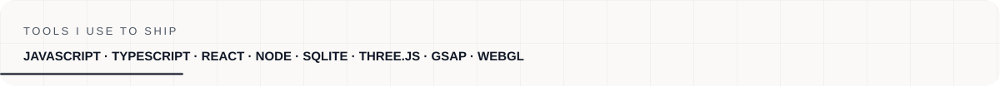

<a href="https://malikahed.github.io/portfolio/">Portfolio</a> · <a href="https://www.linkedin.com/in/malik-abuallatta-a6849a37b/">LinkedIn</a> · <a href="mailto:malikabuallatta@gmail.com">Email</a>

<strong>I build calm, useful browser products for learning, play, and everyday workflows.</strong> Based in Palestine · open to full-stack, frontend, product engineering, and developer-tool work.

<table>
<tr>
<td width="50%" valign="top">

### What I build

- Arabic-first learning tools with clear progress loops
- Offline-capable PWAs that stay useful on imperfect connections
- Explainable browser utilities and small developer systems
- Interactive WebGL experiences with performance in mind

</td>
<td width="50%" valign="top">

### What I care about

- RTL interfaces that feel native, not translated
- Motion that explains state instead of competing with it
- Semantic, accessible UI with good keyboard paths
- Documentation and tests that make work easy to trust

</td>
</tr>
</table>

## Selected work

<table>
<tr>
<td colspan="2" valign="top">

**[Khotwa · Tawjihi Learning App](https://malikahed.github.io/tawjihi-learning-app/)**  
An Arabic-first learning workspace for Palestinian Tawjihi students: structured lessons, practice questions, worked solutions, review cards, and progress tracking.
</td>
</tr>
<tr>
<td width="50%" valign="top">

**[Murajaa](https://malikahed.github.io/Murajaa/)**  
Offline-first Arabic flashcards with spaced repetition, RTL support, and JSON import/export.
</td>
<td width="50%" valign="top">

**[StockThink](https://malikahed.github.io/stockthink/)**  
Private, zero-server chess analysis with Stockfish WebAssembly and explainable move commentary.
</td>
</tr>
<tr>
<td width="50%" valign="top">

**[Portfolio World](https://malikahed.github.io/portfolio/)**  
A Three.js/WebGL portfolio focused on interaction design, composition, and performance.
</td>
<td width="50%" valign="top">

**[Rocket Arena Web](https://malikahed.github.io/rocket-arena-web/)**  
A playable browser game with AI opponents and a complete web build.
</td>
</tr>
</table>

## Toolbelt

<table>
<tr>
<td align="center" valign="top"> JavaScript</td>
<td align="center" valign="top"> TypeScript</td>
<td align="center" valign="top"> React</td>
<td align="center" valign="top"> Node.js</td>
<td align="center" valign="top"> HTML</td>
<td align="center" valign="top"> CSS</td>
<td align="center" valign="top"> Tailwind</td>
<td align="center" valign="top"> Vite</td>
</tr>
<tr>
<td align="center" valign="top"> SQLite</td>
<td align="center" valign="top"> Python</td>
<td align="center" valign="top"> Git</td>
<td align="center" valign="top"> Actions</td>
<td align="center" valign="top"> Three.js</td>
<td align="center" valign="top"> GSAP</td>
<td align="center" valign="top"> WebGL</td>
<td align="center" valign="top"> Playwright</td>
</tr>
<tr>
<td align="center" valign="top"> PWA</td>
<td align="center" valign="top"> Accessibility</td>
<td colspan="6" align="left" valign="middle">Motion, graphics, testing, offline delivery, and accessibility are part of the product—not polish added at the end.</td>
</tr>
</table>

<strong>How I work</strong>

1. Ship a clear product loop before adding more surface area.
2. Keep interfaces responsive, semantic, and accessible.
3. Prefer small systems that are easy to inspect and reproduce.
4. Use source provenance, tests, and documentation to make decisions easier to trust.

Thanks for stopping by. If you are building something useful, I would be glad to hear about it.

