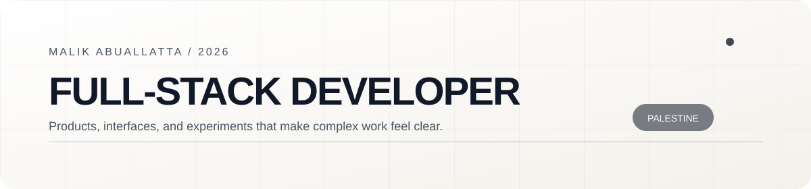
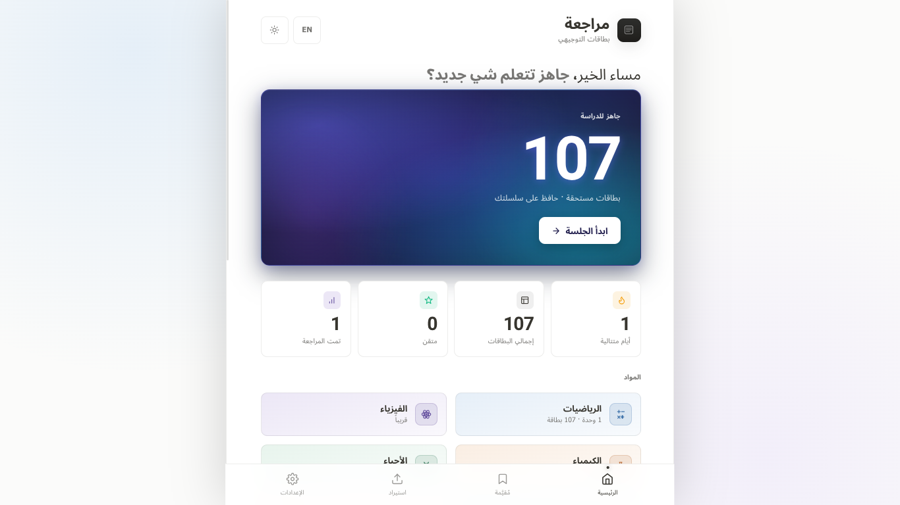
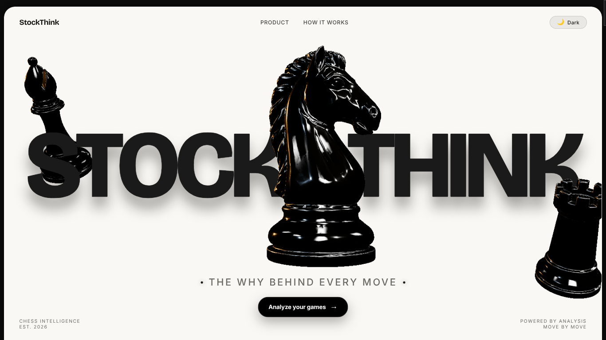
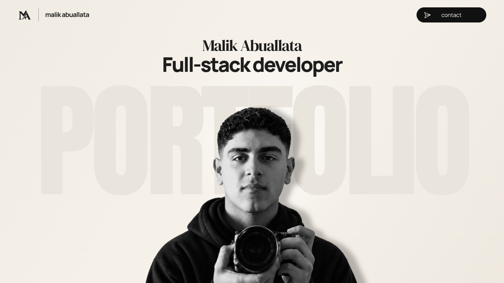

<h3>Calm interfaces for useful browser products.</h3>

Full-stack developer building learning tools, offline-first PWAs, explainable browser utilities, and interactive WebGL experiences from Palestine.

<table border="1" bordercolor="#d2d2cc" cellpadding="14" cellspacing="0" width="100%">
<tr>
<td width="50%" valign="top" bgcolor="#fafaf8">
<h3>What I build</h3>

- Arabic-first learning tools with clear progress loops
- Offline-capable PWAs that stay useful on imperfect connections
- Explainable browser utilities and small developer systems
- Interactive WebGL experiences with performance in mind
</td>
<td width="50%" valign="top" bgcolor="#f3f3ef">
<h3>What I care about</h3>

- RTL interfaces that feel native, not translated
- Motion that explains state instead of competing with it
- Semantic, accessible UI with good keyboard paths
- Documentation and tests that make work easy to trust
</td>
</tr>
</table>

<h2>Selected work</h2>

A few products and experiments I keep coming back to.

<table border="1" bordercolor="#c8c8c0" cellpadding="12" cellspacing="0" width="100%">
<tr>
<td width="50%" valign="top" bgcolor="#fafaf8">

<h3><a href="https://malikahed.github.io/tawjihi-learning-app/">Khotwa · Tawjihi Learning App</a></h3>

Arabic-first learning workspace for Palestinian Tawjihi students with structured lessons, practice questions, worked solutions, review cards, and progress tracking.

  

</td>
<td width="50%" valign="top" bgcolor="#f3f3ef">

<h3><a href="https://malikahed.github.io/Murajaa/">Murajaa</a></h3>

Offline-first Arabic flashcards with spaced repetition, RTL support, progress tracking, and JSON import/export.

  

</td>
</tr>
<tr>
<td width="50%" valign="top" bgcolor="#f3f3ef">

<h3><a href="https://malikahed.github.io/stockthink/">StockThink</a></h3>

Private, zero-server chess analysis in the browser using Stockfish WebAssembly and explainable move commentary.

  

</td>
<td width="50%" valign="top" bgcolor="#fafaf8">

<h3><a href="https://malikahed.github.io/portfolio/">Portfolio World</a></h3>

A cinematic Three.js portfolio for selected browser products, experiments, and case-study links.

  

</td>
</tr>
<tr>
<td width="50%" valign="top" bgcolor="#fafaf8">

<h3><a href="https://malikahed.github.io/rocket-arena-web/">Rocket Arena Web</a></h3>

A compact browser car-soccer game with AI opponents, responsive controls, and a complete web build.

  

</td>
<td width="50%" valign="top" bgcolor="#f3f3ef">

<h3><a href="https://github.com/MalikAhed/our-version-of-black-hole">Our Version of a Black Hole</a></h3>

Interactive Schwarzschild black hole experiment with procedural line paths, Three.js, and Unreal Bloom.

  

</td>
</tr>
</table>

<h2>Toolbelt</h2>

Tools I use to move from a rough idea to a clear, working interface.

<table border="1" bordercolor="#d2d2cc" cellpadding="10" cellspacing="0" width="100%">
<tr>
<td align="center" bgcolor="#fafaf8"></td>
<td align="center" bgcolor="#f3f3ef"></td>
<td align="center" bgcolor="#fafaf8"></td>
<td align="center" bgcolor="#f3f3ef"></td>
</tr>
<tr>
<td align="center" bgcolor="#f3f3ef"></td>
<td align="center" bgcolor="#fafaf8"></td>
<td align="center" bgcolor="#f3f3ef"></td>
<td align="center" bgcolor="#fafaf8"></td>
</tr>
<tr>
<td align="center" bgcolor="#fafaf8"></td>
<td align="center" bgcolor="#f3f3ef"></td>
<td align="center" bgcolor="#fafaf8"></td>
<td align="center" bgcolor="#f3f3ef"></td>
</tr>
</table>

<h2>Let’s connect</h2>

I’m always happy to talk about product ideas, thoughtful interfaces, and browser-native software.

  

Built with care in Palestine · Motion, testing, offline delivery, and accessibility are part of the product.

